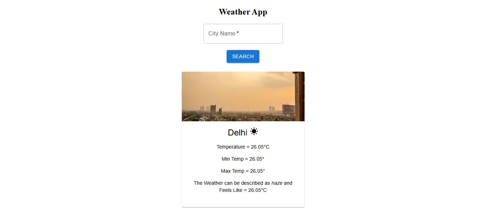

# 🌤️ React Weather App

A simple and responsive weather application built using **React** that fetches real-time weather data using the **OpenWeather API**. Users can search for any city and view temperature, humidity, and weather conditions in a clean UI.

---

## 🚀 Features

* 🔍 Search weather by city name
* 🌡️ Real-time temperature display
* 💧 Humidity & feels-like temperature
* 📉 Min & Max temperature
* 🌥️ Weather condition description
* 🎨 Clean and responsive UI
* ⚡ Fast performance with Vite

---

## 🛠️ Tech Stack

* **React (Vite)**
* **JavaScript (ES6+)**
* **Material UI**
* **OpenWeather API**
* **CSS**

---

## 📸 Screenshot



> *(Make sure your screenshot file is named `screenshot.png` and placed in root folder)*

---

## ⚙️ Installation & Setup

1. Clone the repository

```bash
git clone https://github.com/shanusingh01/react-weather-app.git
```

2. Navigate to project folder

```bash
cd react-weather-app
```

3. Install dependencies

```bash
npm install
```

4. Run the app

```bash
npm run dev
```

---

## 🔑 API Setup

* Get your API key from: https://openweathermap.org/api
* Replace your API key in `SearchBox.jsx`:

```js
const API_KEY = "your_api_key_here";
```

---

## 📂 Project Structure

```
src/
│── App.jsx
│── WeatherApp.jsx
│── SearchBox.jsx
│── InfoBox.jsx
│── App.css
│── index.css
```

---

## 💡 Future Improvements

* 🌍 Add geolocation support
* 📅 5-day forecast
* 🌙 Dark/Light mode toggle
* ❌ Error handling for invalid city

---

## 🤝 Contributing

Contributions are welcome!
Feel free to fork this repo and submit a pull request.

---

## ⭐ Support

If you like this project:

👉 Give it a ⭐ on GitHub
👉 Share it with others

---


## 📜 License

This project is open-source and free to use.
